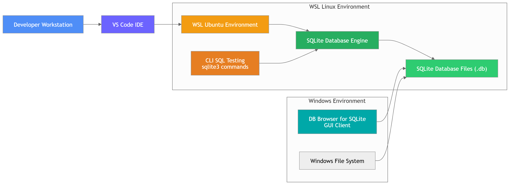

# SQL Hands-On

<p align="center">
  SQL practice materials, SQLite exercises, and a lightweight Python setup for hands-on data work.
</p>

<p align="center">
  
</p>

<p align="center">
  
  
  
</p>

## Overview

This repository is a workspace for learning and practicing SQL.

It combines:

- LinkedIn Learning course assets
- SQLite practice files
- SQL notes and reference material
- A minimal Python project scaffold for later automation or data work

## What You Will Find

| Area | Purpose |
| --- | --- |
| `Exercise Files/` | Practice datasets and SQL scripts |
| `learningsql-2875059/SQLite/` | SQLite database and working queries |
| `learningsql-2875059/Notes/` | SQL notes and syntax references |
| `resources/` | Images and supporting README assets |
| `main.py` | Minimal Python entry point |
| `pyproject.toml` | Project metadata and Python dependencies |

## Quick Start

### 1. Create the environment

```bash
uv venv .venv
source .venv/bin/activate
uv pip install -e .
```

### 2. Check SQLite

```bash
sqlite3 --version
```

### 3. Open the sample database

```bash
sqlite3 "learningsql-2875059/SQLite/quizdata.db"
```

### 4. Run the Python entry point

```bash
python main.py
```

## Suggested Learning Path

1. Read the notes in `Exercise Files/Notes/statements.md`.
2. Explore the sample database in `Exercise Files/SQLite/quizdata.db`.
3. Practice queries with `learningsql-2875059/SQLite/working.sql`.
4. Compare syntax variants in `learningsql-2875059/Other DBMS/`.

## Project Structure

```text
.
├── Exercise Files/
│   ├── Notes/
│   ├── Other DBMS/
│   └── SQLite/
├── learningsql-2875059/
│   ├── Notes/
│   ├── Other DBMS/
│   └── SQLite/
├── resources/
├── main.py
├── pyproject.toml
└── README.md
```

## Tooling

- Python `3.13+`
- `uv` for environment and dependency management
- `sqlite3` for local database work
- Optional GUI tools such as DB Browser for SQLite or VS Code extensions

## Dependencies

The current Python project includes:

- `matplotlib`
- `numpy`
- `pandas`
- `pyspark`

## License

Course materials bundled under `learningsql-2875059/` include their own license and notice files. Review that directory before redistributing course content.
